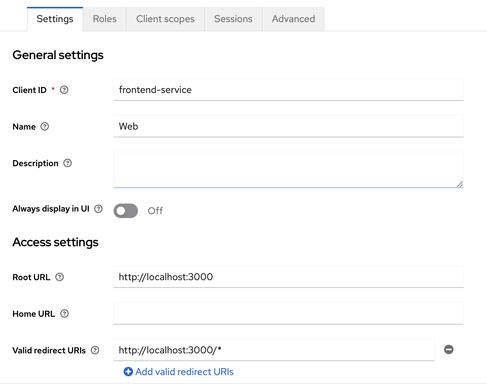
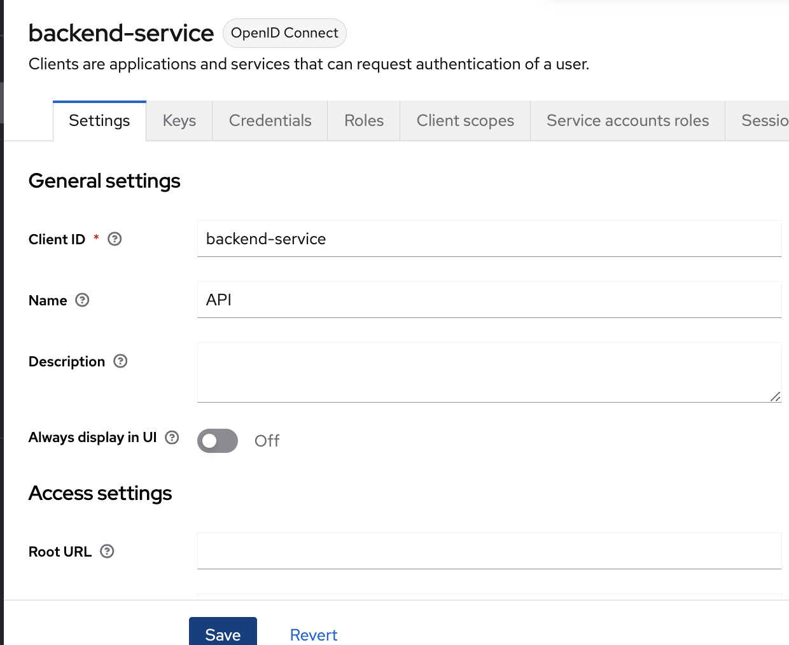
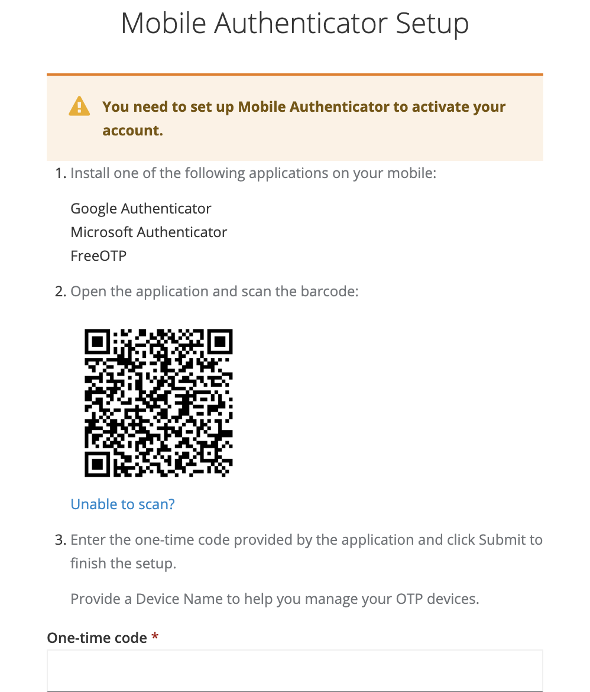
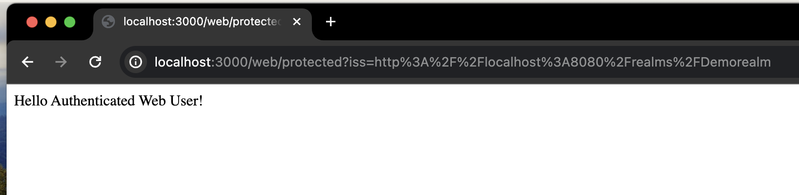
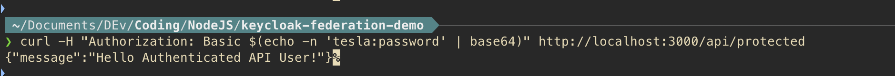

# Keycloak and LDAP integration with node.js

## 1. Abstract

Simple node.js app that demonstrates authentication of web user (with OTP) and API user (just basic auth) against this online LDAP service:

https://www.forumsys.com/2022/05/10/online-ldap-test-server/

Please note that admin credentials for Keycloak and Postgres are hardcoded in docker-compose file. Not for production use!

## 2. Setup

### 2.1 Infrastructure - Keycloak

Keycloak instance in DEV mode with Postgres as backend in Docker via
[docker-compose](docker/docker-compose.yml)

Start services with 
```
cd docker
docker-compose up -d
```

Keycloak Admin Url: http://localhost:8080 \
Username & password: admin 

### 2.2 Keycloak setup

#### 2.2.1 Realm:

Login to Keycloak and create new Realm, i.e. "Demorealm"

#### 2.2.2 User Federation

Switch to Demorealm and set up LDAP User Federation.


#### 2.2.3 Clients:

##### frontend-service: 

Create a client with "frontend_service" as Client ID (or whichever). Used for uthentication for web users. Configure the client to require OTP under "Advanced" via the "Authentication Flow Override" option.




##### backend-service: 

Create a client for basic auth for API users (Client ID = backend-service) Basic HTTP auth




### 3. Environment vars

Copy the .env-template to .env and configure variables

AUTH_SERVER_URL=http://localhost:8080/ \
REALM=Demorealm \
SESSION_SECRET="whateveryouwant" \
WEB_CLIENT_ID=frontend-service \
WEB_CLIENT_SECRET= # optional \
API_CLIENT_ID=backend-service \
API_CLIENT_SECRET=whateverkeywascreated \

### 4. Source code

Main files:

[server.js](src/server.js):  Starts the application on port 3000, sets up session store and routes \
[webEndpoints.js](src/webEndpoints.js): Implements simple webpage that requires authentication \
[apiEndpoints.js](src/apiEndpoints.js): Implements simple API that requires basic auth \

### 5. Run

Install dependencies with:
```npm install```

This will fetch these dependencies:
* axios
* basic-auth
* body-parser
* express
* express-session
* keycloak-connect

Then start server with:
```node server.js```   

To test:
Web: 

Navigate to http://localhost:3000/web/protected in browser.

Login with einstein / password

You will need to setup OTP



You should see the super secret homepage:


API: 

Use CURL to test API:

```  
curl -H "Authorization: Basic $(echo -n 'tesla:password' | base64)" http://localhost:3000/api/protected
```  
You should now see authenticated message:


